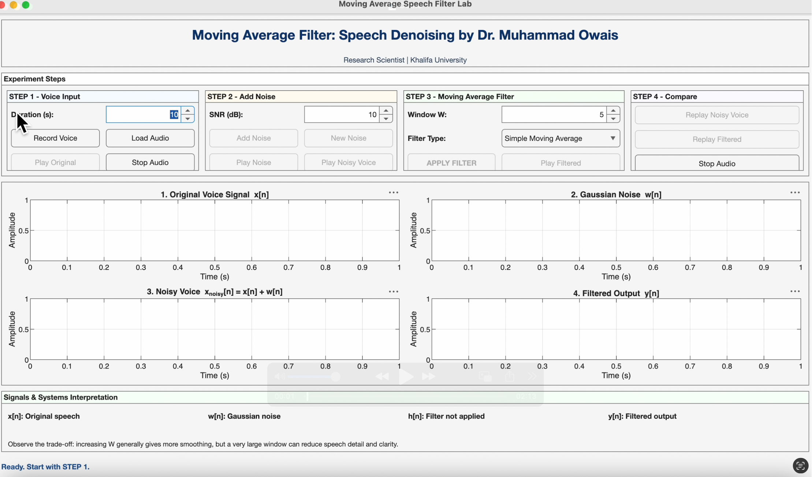

<div align="center">

# 🎙️ Moving Average Speech Lab

### Interactive MATLAB GUI for Speech Denoising & Signal Smoothing

**Muhammad Owais**  
Research Scientist  
*Signals and Systems for Robotics*

<br>


<br>

> A simple, visual, and interactive MATLAB tool to understand how  
> **moving-average filters reduce noise in real speech signals.**

<br>



</div>

---

## 🌟 What This Tool Does

This MATLAB GUI turns a core **Signals and Systems** concept into a practical experiment.

Students can:

<table>
<tr>
<td width="25%" align="center"><b>🎤 Record</b><br>Record or load speech</td>
<td width="25%" align="center"><b>🌫 Add Noise</b><br>Add Gaussian noise</td>
<td width="25%" align="center"><b>📉 Filter</b><br>Apply moving-average filtering</td>
<td width="25%" align="center"><b>🎧 Compare</b><br>Listen and compare results</td>
</tr>
</table>

The complete learning flow is:

```text
Original Voice
     ↓
   x[n]
     ↓
Add Gaussian Noise
     ↓
xnoisy[n] = x[n] + w[n]
     ↓
Moving Average Filter h[n]
     ↓
   y[n]
     ↓
Filtered Voice
```

---

# 🚀 Quick Start

## 1. Download the repository

Clone the repository or download it as a ZIP.

## 2. Open MATLAB

Set the repository folder as your current MATLAB folder.

## 3. Run

```matlab
MovingAverageSpeechLabByOwais
```

The GUI will open automatically.

---

# 🧭 Four-Step Learning Workflow

## ① Record or Load Voice

Record a short speech sample directly using the computer microphone, or load an existing audio file.

The original discrete-time signal is represented as:

\[
x[n]
\]

Recommended recording length:

```text
10–15 seconds
```

---

## ② Add Gaussian Noise

The GUI generates Gaussian noise:

\[
w[n]
\]

and adds it to the original speech:

\[
x_{\text{noisy}}[n] = x[n] + w[n]
\]

The user can control the amount of noise using **SNR (dB)**.

The GUI shows:

- original speech,
- Gaussian noise,
- noisy speech.

You can also listen to each signal separately.

---

## ③ Apply the Moving Average Filter

For a \(W\)-point moving average:

\[
y[n]
=
\frac{1}{W}
\sum_{k=0}^{W-1}
x_{\text{noisy}}[n-k]
\]

For example, with \(W=3\):

\[
y[n]
=
\frac{x[n]+x[n-1]+x[n-2]}{3}
\]

The equivalent FIR impulse response is:

\[
h[n]
=
\left[
\frac{1}{3},
\frac{1}{3},
\frac{1}{3}
\right]
\]

Therefore:

\[
y[n]=x[n]*h[n]
\]

---

## ④ Compare the Output

The GUI lets you visually and audibly compare:

<table>
<tr>
<th>Signal</th>
<th>Meaning</th>
</tr>
<tr>
<td><b>x[n]</b></td>
<td>Original speech</td>
</tr>
<tr>
<td><b>w[n]</b></td>
<td>Gaussian noise</td>
</tr>
<tr>
<td><b>x<sub>noisy</sub>[n]</b></td>
<td>Speech after adding noise</td>
</tr>
<tr>
<td><b>h[n]</b></td>
<td>Moving-average filter coefficients</td>
</tr>
<tr>
<td><b>y[n]</b></td>
<td>Filtered output</td>
</tr>
</table>

---

# 🎛️ Filter Modes

## Simple Moving Average

All samples receive equal weight.

Example:

\[
h[n]
=
\left[
\frac{1}{3},
\frac{1}{3},
\frac{1}{3}
\right]
\]

and

\[
y[n]
=
\frac{x[n]+x[n-1]+x[n-2]}{3}
\]

---

## Weighted Moving Average

Recent samples can receive greater importance.

Example:

\[
y[n]
=
0.5x[n]
+
0.3x[n-1]
+
0.2x[n-2]
\]

with:

\[
h[n]=[0.5,\;0.3,\;0.2]
\]

---

# 🔍 Window Size Experiment

The GUI allows students to test different window sizes.

Suggested values:

| Window | Expected Behaviour |
|---:|---|
| **3** | Light smoothing, better detail preservation |
| **5** | Moderate smoothing |
| **10** | Stronger smoothing, but more speech detail may be lost |

### Key idea

> A larger window generally removes more rapid fluctuations,  
> but too much smoothing may reduce speech clarity.

---

# 🧠 Signals & Systems Connection

This tool connects multiple course topics in one experiment.

<table>
<tr>
<td width="33%" align="center">

### Difference Equation

\[
y[n]
=
\sum h[k]x[n-k]
\]

</td>
<td width="33%" align="center">

### Impulse Response

\[
h[n]
\]

defines the filter

</td>
<td width="33%" align="center">

### Convolution

\[
y[n]=x[n]*h[n]
\]

</td>
</tr>
</table>

So the learning path becomes:

```text
Difference Equation
        ↓
Impulse Response h[n]
        ↓
Convolution
        ↓
Moving Average Filter
        ↓
Practical Speech Smoothing
```

---

# ➕ Padding and Same-Length Output

At the beginning of the signal, some previous samples do not exist.

For example:

\[
y[0]
=
\frac{x[0]+x[-1]+x[-2]}{3}
\]

For causal filtering, missing previous samples are treated as zero:

\[
x[-1]=0,
\qquad
x[-2]=0
\]

The GUI keeps the filtered signal length equal to the input length:

\[
N_{\text{output}}
=
N_{\text{input}}
\]

---

# 🎓 Suggested Student Activity

Students can use the tool as a short laboratory exercise.

### Experiment 1 — Original Signal

Record your voice and observe the waveform.

### Experiment 2 — Add Noise

Choose an SNR value and observe how the signal changes.

### Experiment 3 — 3-Point Filter

Set:

\[
W=3
\]

Listen to the filtered output.

### Experiment 4 — 5-Point Filter

Set:

\[
W=5
\]

Compare it with the 3-point result.

### Experiment 5 — 10-Point Filter

Set:

\[
W=10
\]

Observe stronger smoothing.

### Experiment 6 — Weighted Average

Switch from:

```text
Simple Moving Average
```

to:

```text
Weighted Moving Average
```

and compare the result.

---

# ❓ Questions for Students

1. Did the moving-average filter reduce the noise?
2. Which window size produced the best result?
3. What happened to the speech quality when the window size increased?
4. Why does a larger window produce stronger smoothing?
5. What is the trade-off between noise reduction and signal preservation?
6. What is the difference between simple and weighted moving averages?
7. What do \(x[n]\), \(h[n]\), and \(y[n]\) represent?
8. Why is zero-padding required at the beginning of the signal?

---

# ⚖️ Engineering Trade-Off

<div align="center">

### More Smoothing  
⬇  
### More Noise Reduction  
⬇  
### Possible Loss of Signal Detail

</div>

The main engineering trade-off is:

\[
\boxed{
\text{Noise Reduction}
\longleftrightarrow
\text{Signal Preservation}
}
\]

This is an important lesson in real-world signal processing.

---

# 🖥️ GUI Features

- 🎙 Microphone voice recording
- 📂 Audio file loading
- 📈 Original signal visualization
- 🌫 Gaussian noise generation
- 🎚 Adjustable SNR
- 📊 Separate noise visualization
- 🔊 Original / noise / noisy / filtered audio playback
- 🪟 Moving-average window selection
- ⚙ Simple moving average
- ⚖ Weighted moving average
- 📉 Filtered signal visualization
- 🔁 Replay and comparison controls
- 🧮 Filter coefficient display
- 📚 Signals & Systems interpretation
- ➕ Causal zero-padding
- 📏 Same-length output

---

# 📁 Repository Structure

```text
Moving-Average-Speech-Lab-MATLAB/
│
├── MovingAverageSpeechLabByOwais.m
├── README.md
├── LICENSE
└── gui.png
```

---

# 🧰 Requirements

- MATLAB
- Computer microphone for direct recording
- Audio playback device

The GUI uses MATLAB functions such as:

```matlab
uifigure
uiaxes
uigridlayout
audiorecorder
audioplayer
audioread
filter
```

---

# 💡 Educational Applications

This tool can be used in:

- Signals and Systems
- Digital Signal Processing
- Robotics signal processing
- MATLAB laboratory sessions
- FIR filtering demonstrations
- Difference-equation lectures
- Convolution demonstrations
- Speech-processing exercises
- Classroom tutorials
- Student self-learning

---

# 👨‍💻 Author

<div align="center">

## Muhammad Owais

**Research Scientist, Khalifa University, UAE**


</div>

---

# 📖 Citation

If you use this tool in teaching, demonstrations, coursework, research, presentations, or educational material, please cite it.

### Recommended Citation

```text
M. Owais, "Moving Average Speech Lab: An Interactive MATLAB Tool for
Speech Denoising and Moving Average Filter Demonstration," MATLAB software,
2026.
```

### BibTeX

```bibtex
@software{owais2026movingaverage,
  author  = {Muhammad Owais},
  title   = {Moving Average Speech Lab: An Interactive MATLAB Tool for Speech Denoising and Moving Average Filter Demonstration},
  year    = {2026},
  note    = {MATLAB Educational Software},
  url     = {https://github.com/Owais-CodeHub/SpeechLab}
}
```
https://github.com/Owais-CodeHub/SpeechLab

---

<div align="center">

# ⭐ Moving Average Speech Lab

### Learn by Seeing. Learn by Listening. Learn by Experimenting.

If this tool is useful for teaching or learning, please consider giving the repository a ⭐.

</div>
